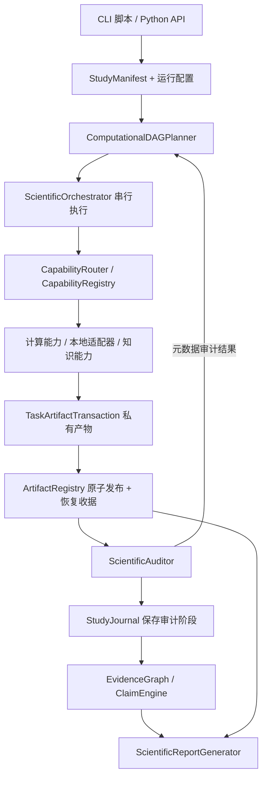

# EACBP 当前架构梳理与检查

> 历史检查说明：本文主体记录 2026-09-16 的代码状态，不能作为当前缺陷清单。后续代码已加入必需审计覆盖检查、保留注入注册表并拒绝隐式重复注册；P2 已实现多目标独立分支。运行配置与审计改进见 ARCHITECTURE_OPTIMIZATION.md，能力声明、多目标与维护工具见 ARCHITECTURE_P2.md。新增能力和架构重构请结合当前源码与 README 阅读；本页历史测试数量也不代表当前测试数量。

检查日期：2026-09-16。基于当前工作区（包含已有未提交修改），不是仅基于 HEAD。此次新增架构说明，不修改业务实现。历史规划中的完成声明不作为检查依据。

## 1. 项目定位

当前项目是 Python 模块化单体、本地同步执行的科研工作流引擎。核心价值是将计算结果、审计、证据与报告连接起来，并支持带完整性校验的任务恢复。

不是分布式调度平台；没有 Web/API 服务、用户权限系统或在线外部 Agent 服务。Slurm 文件是整条流程的提交包装，不是每个 DAG 节点的分布式执行器。知识检索使用本地整理的数据。现有目录中共有 64 个包内 Python 文件、26 个测试文件。

## 2. 架构与执行链

关键顺序：计算成功后先发布产物，再做科学审计，最后保存审计阶段并接纳证据。因此“注册表中存在产物”不等于“产物已经通过科学审计”。主编排器会阻止失败任务的下游执行，但直接使用注册表的调用者必须理解这一边界。

| 模块 | 当前职责 | 主要入口 |
|---|---|---|
| `schemas` | 研究、任务、产物、证据的数据合同 | `StudyManifest`、`TaskContract`、`TaskResult` |
| `orchestrator` | 规则式意图解析、构建 DAG、方法路由、串行调度、恢复 | `ScientificOrchestrator.run_study()` |
| `capabilities` | FASTQ 定量、QC、归一化、整合、聚类、差异分析、轨迹、空间、模拟 | `BaseCapability.execute()` |
| `adapters` | SpaCell/ChatCell/GeneAgent 风格的本地计算封装 | `BaseAgentAdapter` |
| `artifact` | 文件存储、URI、SHA-256、血缘、事务发布 | `ArtifactRegistry` |
| `auditor` | 计算、统计、生物学规则检查 | `ScientificAuditor.audit_task()` |
| `knowledge` | 本地文献与生物学字典、上下文检索 | `KnowledgeRetrievalCapability` |
| `evidence` | 提取证据、约束表述、生成结论与关联图 | `ClaimEngine` |
| `report` | Markdown 与句子级来源追溯 | `ScientificReportGenerator` |

主数据通路为 FASTQ（可选）→原始矩阵→元数据审计→QC→归一化→整合→聚类/注释→可选目标细胞子集→差异表达/丰度/轨迹。空间、知识、适配器及扰动是按条件加入的分支；CellRank 依赖显式根细胞与终末状态。

`baseline` 是轻量算法；`standard` 调用 Harmony、Scanpy Leiden/UMAP/DPT 等真实库。两种 profile 共享调度、产物、审计与证据机制。未指定 profile 时，主编排器根据 demo/模拟来源选择 baseline，否则选择 standard。

## 3. 入口、状态与持久化

| 入口 | 用途 |
|---|---|
| `scripts/run_standard_study.py` | 通用 h5ad 研究，显式指定物种、组织与分析参数 |
| `scripts/run_fastq_to_biology_pipeline.py` | FASTQ 起始的流程 |
| `scripts/run_kat8_study.py` | Kat8 专题流程 |
| `slurm/*.sbatch` | 服务器批处理包装 |

脚本负责输入导入、创建 run 目录、构造 manifest/state、调用编排器以及写报告。报告不由 `run_study()` 自动持久化。打包配置目前没有统一的 console-script 入口，脚本也不随包一起安装。

- `SCData` 是内部矩阵容器，支持 AnnData 转换与稀疏矩阵。
- `.artifact_registry.json` 保存产物元数据、血缘及任务提交收据；这是本地索引，不是数据库服务。
- `_transactions/<uuid>/` 同时容纳未提交尝试和已提交产物的实际文件，不能整体当作临时缓存清理。
- `_runs/<study-id-hash>.json` 保存任务恢复日志；进程锁阻止同一 study 同时执行。
- 恢复签名包含合同、输入摘要、manifest；严格模式还包含包源码和已安装依赖信息。恢复结果会重新审计。
- EvidenceGraph、审计报告对象和调度状态主要在内存中；恢复时重建证据，尚无独立、版本化的证据数据库。

实际有三类图：计算依赖图、产物血缘图、证据—结论图。“两张 DAG”是历史概念概括，不能替代对三种实现的分别理解。

## 4. 已确认的问题

P1 表示应优先修正的合同可靠性问题；P2 表示影响部分输入或扩展场景的问题。以下前三项均用当前虚拟环境中的最小示例复现。

### P1：声明的必需审计项没有强制执行

位置：`eacbp/schemas/task.py:57`、`eacbp/auditor/__init__.py:24`。

`validation_requirements` 在 planner 中大量填写，但审计器根据 capability/type 分支运行检查，没有核对每个必需检查是否实际执行。最小示例要求 `must_run_custom_check`，实际只执行 `json_valid_payload`，最终 `overall_passed=True`。

影响：新增能力或增加合同要求后，调用者可能误以为新增要求已经生效。现有固定检查仍会运行，此问题不等于“整个审计不存在”。

建议：建立检查 ID 注册表，统一历史别名；校验“所需项 ⊆ 已执行项”，缺失或未知项明确失败；明确区分必需检查与建议检查。为已内置合同先做映射，避免直接比较现有不一致的名称导致全面误拒绝。

### P2：多个目标细胞类型被静默截断

位置：`scripts/run_standard_study.py:37`、`eacbp/orchestrator/dag.py:158`。

CLI 支持重复 `--target-cell-type`，schema 也使用列表，但 planner 只读取 `[0]`。输入 `['T_cell', 'B_cell']`，只生成 `T_cell` 子集任务。

影响：使用者请求多个细胞群时，后续差异分析等只覆盖第一个，而知识层仍可能收到完整列表。

建议：近期先明确拒绝多目标输入；后续用目标分支展开并为每个分支分配独立 task ID、产物 URI 和报告分组。

### P2：注入的同名适配器被默认实现覆盖

位置：`eacbp/orchestrator/loop.py:71`、`eacbp/adapters/__init__.py:17`、`eacbp/capabilities/registry.py:19`。

编排器接收自定义 registry 后，无条件执行 `register_all_adapters()`；`register()` 对相同 capability/implementation 键直接覆盖。复现中预先注册的 ChatCellAdapter 对象在编排器初始化后被替换。

影响：自定义同名实现、测试替身或带特殊配置的适配器无法可靠注入。

建议：默认工厂集中组装全部内置能力；使用者显式传入 registry 时保留其内容；重复注册默认报错，覆盖必须使用显式参数。

### P2：部分配置字段只声明，未接入运行控制

位置：`eacbp/schemas/study.py:44`、`eacbp/orchestrator/policy.py:10`。

源码检索显示 `max_runtime_hours`、`gpu_allowed`、`save_intermediate_artifacts` 没有执行侧消费者；`prefer_pseudobulk` 虽在独立 `ScientificPolicy` 中使用，但主编排链未调用该策略类，报告却会显示这个选项。

影响：配置接口表达的能力超过实际执行行为。例如设置 max_runtime_hours 不会建立 study 级超时。

建议：接入预算/策略执行，或者明确标记暂不支持并拒绝非默认设置。中间产物保存策略必须与恢复功能一起设计，不能直接删除恢复所需文件。

## 5. 架构债务与边界

这些是基于源码的维护性/扩展性判断，未作为已复现的运行失败报告。

1. **装配和调度混在一起。** `ScientificOrchestrator.__init__()` 导入并补齐具体能力；默认工厂只注册部分能力。增加能力常需同时修改 factory、loop、router、planner、审计和证据提取。应设置单一装配入口。
2. **计划和运行配置缺少统一类型。** `current_state` 混合用户设置与能力返回的 metrics，并以字典展开合并；执行前又重写 `task.method`，部分能力还重写 `allowed_operations`。建议分离不可变 RunConfig、ObservedState 和 ResolvedTaskContract，在执行前完成路由、参数校验与合同冻结。
3. **存储层反向依赖计算层的数据类型。** AST 检查发现 `artifact → capabilities` 与 `capabilities → artifact` 双向依赖，核心原因是 SCData/序列化耦合；这不直接等于 Python 导入环故障。建议将 SCData 移入独立 data 模块，通过序列化接口隔离存储。
4. **内存和 I/O 成本需要测量。** registry 的每次刷新都读取索引并重建血缘；同一个输入/输出在合同校验、计算、审计中会重复加载和哈希。大量矩阵和产物下可能昂贵，目前未做性能基准。可先增加计时与峰值内存观测，再设计只读缓存/快照。
5. **副作用检查不是安全沙箱。** 部分检查依赖能力自报 operations，并主要比较第一组输入输出。当前内置能力可以沿用此边界；若接入不可信外部代码，需要隔离进程、受控文件访问与更完整的不变量检查。
6. **研究模板与通用调度未完全分开。** planner 仍保留 Microglia/Kat8 历史命名，再通过条件和 URI 替换实现通用化。建议拆出模板、目标分支构建器与通用 DAG 校验。
7. **文档与交付入口需要统一。** PROJECT/TEST 文档已有历史标签，但旧的 singleton、content-addressed、在线检索、校准置信度等描述仍易误导。当前存储是版本 URI + 内容哈希校验，不是按内容摘要寻址；审计是独立模块，不是独立进程或独立人工复核。

## 6. 建议实施顺序

1. 修正必需审计项、多个目标静默截断、自定义 registry 覆盖三个问题，分别加入针对性回归测试。
2. 统一 RunConfig 与能力装配入口，梳理未生效配置；把计划路由和合同解析从执行循环中分离。
3. 拆分研究模板；增加计划预览、CLI resume 和统一包入口，使运行目录、参数与报告更容易追溯。
4. 独立 SCData/序列化边界；测量后优化索引和矩阵重复读取。
5. 在有实际多用户或多节点需求后再考虑服务化；现阶段没有必要为架构整洁而拆微服务。

## 7. 验证记录

- 静态阅读：入口脚本、配置、planner/router/loop/checkpoint、registry/transaction、审计、证据、报告及 CI 定义；AST 统计跨模块导入。
- 最小复现：多目标只生成第一个子集；注入适配器被替换；缺失必需检查仍通过审计。
- 完整测试：`.venv/Scripts/python.exe -m pytest -q --basetemp=temp_architecture_review_20260916`，结果 **156 passed、131 warnings，93.48 秒**。警告主要是 AnnData 索引字符串转换，另有统计精度损失和 Leiden 实现性能提示。测试通过不代表上述未覆盖合同边界没有问题。
- 范围限制：本轮不执行真实 FASTQ 比对、不证明科学结论有效性、不验证远程 CI，不做大数据性能基准。
